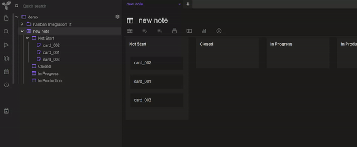

# trilium-kanban
A Kanban integration for Trilium Notes

## Installation

1. Download the latest release from the [releases page](https://github.com/CyrilLeblanc/trilium-kanban/releases)
2. Import the `.zip` file into Trilium by right-clicking on a note and selecting `Import into note`.
3. Setup a Kanban board. See [Usage](#usage) for more details.

## Features

- Kanban view for child notes.
- Drag and drop to change the order of items.
- Drag and drop to change the board of an item.
- Drag and drop to change the order of boards.
- Click on an item to open the note.

## Create a Kanban board

- Create a note of type `Render Note`.
- Add the relation to `~renderNote=kanban` HTML note.
- Add the label `#sortOrder=sortOrder`.
- Create a board by creating a sub-note.
- Create an item by creating a sub-note of a board.

## Credits
- [Trilium Notes](https://github.com/zadam/trilium)
- [jKanban](https://github.com/riktar/jkanban)